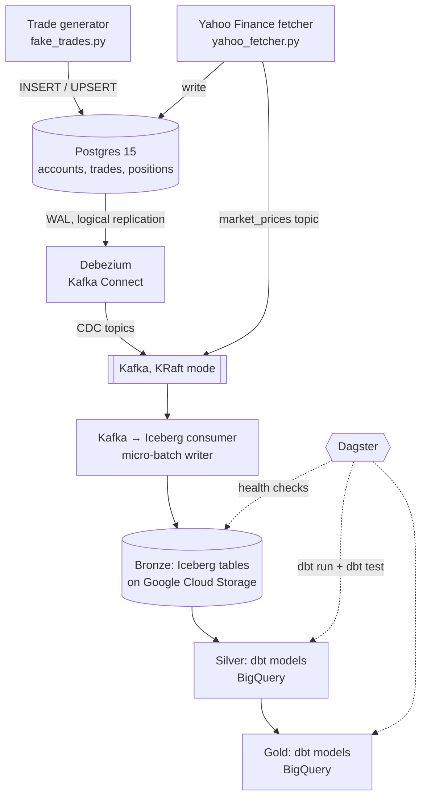

# Market Pulse

A real-time data pipeline for a simulated stock brokerage. Trades and positions are captured from Postgres with change data capture (CDC), streamed through Kafka alongside live Yahoo Finance prices, landed as Apache Iceberg tables on Google Cloud Storage, and transformed with dbt on BigQuery into portfolio analytics. Dagster orchestrates validation, transformations, and scheduling.

## Architecture



## Tech stack

| Layer | Tools |
|---|---|
| Source database | PostgreSQL 15 (logical replication enabled) |
| Change data capture | Debezium 2.4 on Kafka Connect |
| Streaming | Apache Kafka 7.6 (KRaft, no ZooKeeper), Kafka UI |
| Market data | Yahoo Finance via `yfinance` |
| Data lake (bronze) | Apache Iceberg via PyIceberg, stored on Google Cloud Storage |
| Warehouse | Google BigQuery |
| Transformations | dbt (silver and gold layers, with tests) |
| Orchestration | Dagster + `dagster-dbt` |
| Infrastructure | Docker Compose |

## How the pipeline works

### 1. Source system
Postgres holds four tables modelling a brokerage: `accounts` (10 seeded customers), `trades`, `positions`, and `market_prices`. `fake_trades.py` places a random BUY or SELL across eight tickers (AAPL, GOOGL, TSLA, MSFT, AMZN, NVDA, META, NFLX) every 3 seconds. Each trade and its position update run in a single transaction, and the position's weighted average buy price is recalculated with `INSERT ... ON CONFLICT DO UPDATE`.

`yahoo_fetcher.py` pulls the latest 1-minute OHLCV bar for each ticker every 60 seconds and writes it both to Postgres and to a `market_prices` Kafka topic, keyed by ticker so each stock's events stay ordered within one partition.

### 2. Change data capture
Debezium reads the Postgres write-ahead log and publishes every insert, update, and delete on `trades`, `positions`, and `accounts` to Kafka topics (`market_pulse.public.<table>`). The application never publishes these events itself, so the stream can't drift from the database. The `ExtractNewRecordState` transform flattens Debezium's envelope into plain rows, and decimals are emitted as strings to preserve precision.

### 3. Bronze layer (Iceberg on GCS)
`kafka_to_iceberg_consumer.py` subscribes to all four topics and appends to Iceberg tables:

- **Micro-batching:** each table's buffer flushes at 100 messages or every 30 seconds.
- **At-least-once delivery:** Kafka auto-commit is disabled; offsets are committed only after a successful write, so a crash never loses data (duplicates are handled downstream).
- **Lineage metadata:** every row carries `_ingested_at`, `_kafka_topic`, `_kafka_partition`, `_kafka_offset`, and `_cdc_op`.
- **Partitioning:** trades and positions by ingestion day; market prices by ingestion day and ticker.
- **Schema control:** explicit Iceberg schemas, with incoming fields filtered to each table's schema and types normalized before writing through PyArrow.

`validate_bronze.py` reports row counts, schemas, null checks on critical fields, and recent Iceberg snapshots (time travel history).

### 4. Silver layer (dbt)
Cleans and types the raw data:

- Casts string prices to `NUMERIC` and Debezium epoch-microsecond timestamps to `TIMESTAMP`.
- Filters out CDC delete events (and snapshot reads for trades).
- Deduplicates trades by `trade_id` with `ROW_NUMBER()`, since at-least-once delivery can produce repeats.
- Keeps only the latest state per key for positions (account + ticker) and accounts.

Tests: `unique`, `not_null`, and `accepted_values` on tickers and trade types.

### 5. Gold layer (dbt)

| Model | Grain | What it answers |
|---|---|---|
| `gold_portfolio_summary` | account × ticker | Market value, total invested, unrealized P&L and P&L %, profit/loss status |
| `gold_trading_activity` | account × ticker | Buy/sell counts, shares traded, money spent and received, activity rank |
| `gold_price_analytics` | ticker × day | Daily OHLCV, range, return, moving averages, momentum signal, volume rank, day-over-day change |
| `gold_account_performance` | account | Overall portfolio return, best/worst position, performance label and rank |

### 6. Orchestration (Dagster)
`dagster-dbt` loads every dbt model as a Dagster asset and builds the dependency graph from dbt's `ref()` calls. Two custom bronze assets run upstream: a health check that fails if any Iceberg table is empty, and a `dbt source freshness` check.

| Job | Runs | Schedule |
|---|---|---|
| `bronze_validation_job` | Bronze health and freshness checks | on demand |
| `dbt_transformation_job` | All silver and gold models, then `dbt test` | hourly (`0 * * * *`) |
| `full_pipeline_job` | Bronze checks, then all dbt models | daily at 6:00 (`0 6 * * *`) |

## Repository layout

```
market-pulse/
├── docker-compose.yml          # Postgres, Kafka, Kafka Connect (Debezium), Kafka UI
├── init/01_schema.sql          # Source tables and seed accounts
├── data_generators/
│   ├── fake_trades.py          # Simulated trading activity
│   ├── yahoo_fetcher.py        # Live prices → Postgres + Kafka
│   └── kafka_producer.py       # Shared Kafka producer helpers
├── ingestion/
│   ├── debezium_postgres_connector.json
│   ├── register_connector.sh   # Registers the Debezium connector
│   ├── setup_iceberg_tables.py # Creates bronze Iceberg tables
│   ├── kafka_to_iceberg_consumer.py
│   └── validate_bronze.py
├── dbt_project/
│   └── models/
│       ├── sources/            # Bronze source definitions
│       ├── silver/             # Cleaned, typed, deduplicated
│       └── gold/               # Business analytics
├── orchestration/              # Dagster assets, jobs, schedules, definitions
├── workspace.yaml
└── requirements.txt
```

## Running it locally

### Prerequisites
- Docker and Docker Compose
- Python 3.10+
- A GCP project with a GCS bucket, BigQuery enabled, and a service account key
- A dbt profile named `market_pulse` in `~/.dbt/profiles.yml` pointing at BigQuery

### Environment variables
Create a `.env` file in the repo root:

```
POSTGRES_USER=market_user
POSTGRES_PASSWORD=your_password
POSTGRES_DB=market_pulse
POSTGRES_HOST=localhost
POSTGRES_PORT=5433

KAFKA_BOOTSTRAP_SERVERS=localhost:29092

GCP_PROJECT_ID=your-gcp-project
GCS_BUCKET=your-bucket
GOOGLE_APPLICATION_CREDENTIALS=path/to/service-account.json
ICEBERG_CATALOG_DB=market_pulse_catalog.db
ICEBERG_CATALOG_NAME=market_pulse
```

### Steps

```bash
# 1. Install dependencies
pip install -r requirements.txt

# 2. Start Postgres, Kafka, Kafka Connect, and Kafka UI
docker compose up -d

# 3. Register the Debezium connector
bash ingestion/register_connector.sh

# 4. Create the bronze Iceberg tables
python ingestion/setup_iceberg_tables.py

# 5. Start the data sources (separate terminals)
python data_generators/fake_trades.py
python -m data_generators.yahoo_fetcher

# 6. Start the Kafka → Iceberg consumer
python ingestion/kafka_to_iceberg_consumer.py

# 7. Check bronze data landed
python ingestion/validate_bronze.py

# 8. Compile dbt (Dagster reads the manifest), then launch Dagster
cd dbt_project && dbt compile && cd ..
dagster dev
```

Kafka UI is at http://localhost:8080 and the Dagster UI at http://localhost:3000.

> The dbt sources read from a `bronze` dataset in BigQuery, which needs tables pointing at the Iceberg data on GCS (for example, BigLake/external Iceberg tables) before dbt can run.

## Design decisions

- **CDC instead of dual writes for transactional data.** Debezium reads committed changes from the WAL, so Kafka always reflects what actually happened in the database.
- **Raw bronze, typed silver.** Bronze stores values as they arrive (prices as strings) so nothing is lost to premature casting; typing and cleaning happen in dbt where they're versioned and tested.
- **At-least-once plus downstream dedup.** Committing offsets only after writes guarantees no data loss; silver-layer `ROW_NUMBER()` dedup makes the result effectively exactly-once.
- **Streaming and batch separated.** The consumer runs continuously; Dagster handles batch transformations and monitors that streaming data is arriving.

## Roadmap

- Calculate daily open/close from the first and last bar of each day rather than min/max
- Rename the snapshot-based moving average in `gold_portfolio_summary` or compute it over true daily closes
- Add freshness thresholds to dbt sources
- Move the Debezium connector credentials to environment variables
- Run the Iceberg consumer as a monitored service and add dead-letter handling for unparseable messages
- Add a dashboard on top of the gold layer
